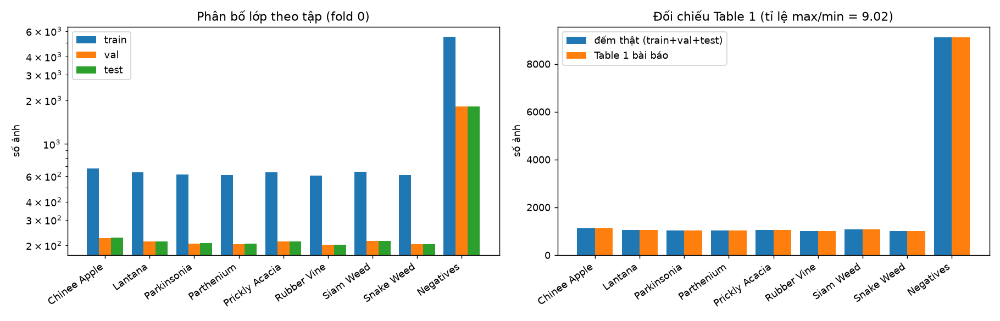
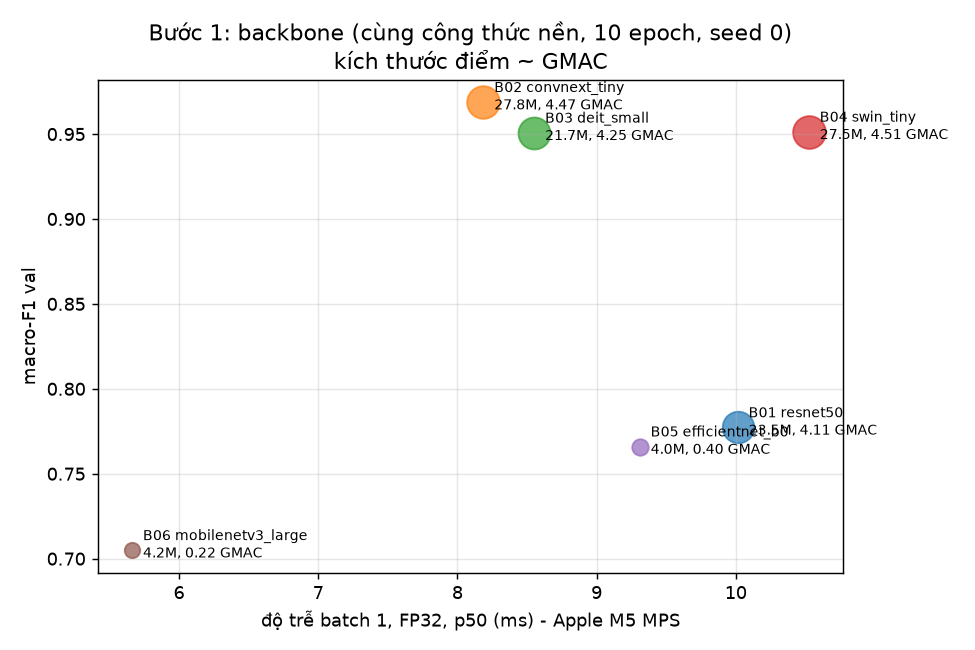
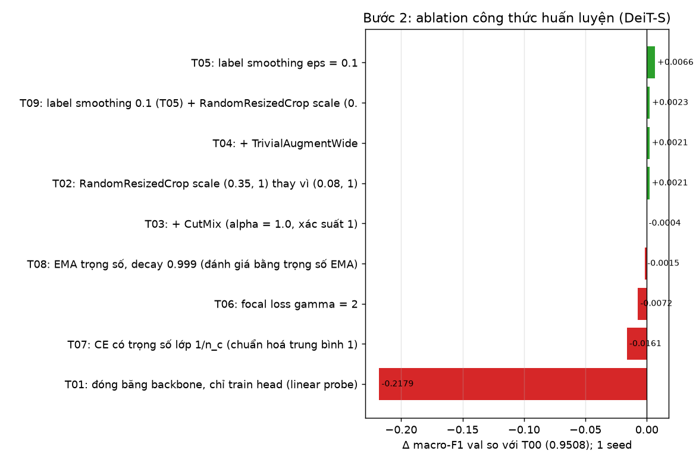
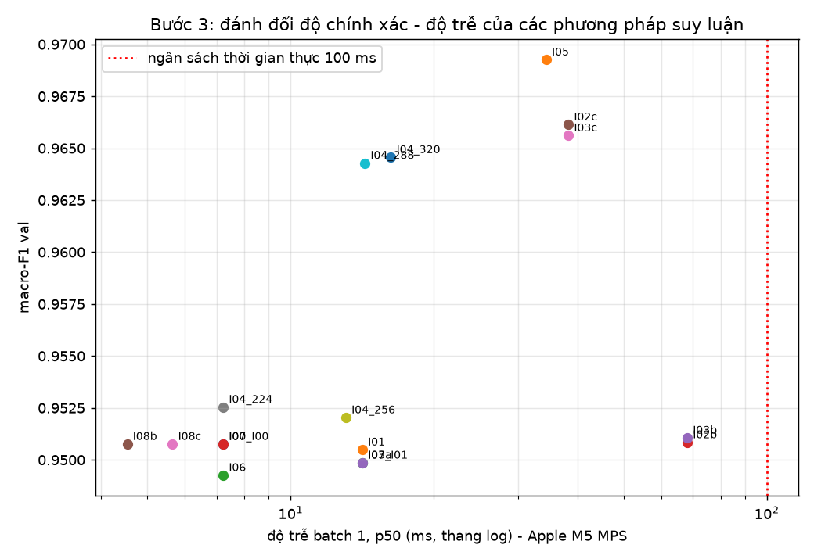
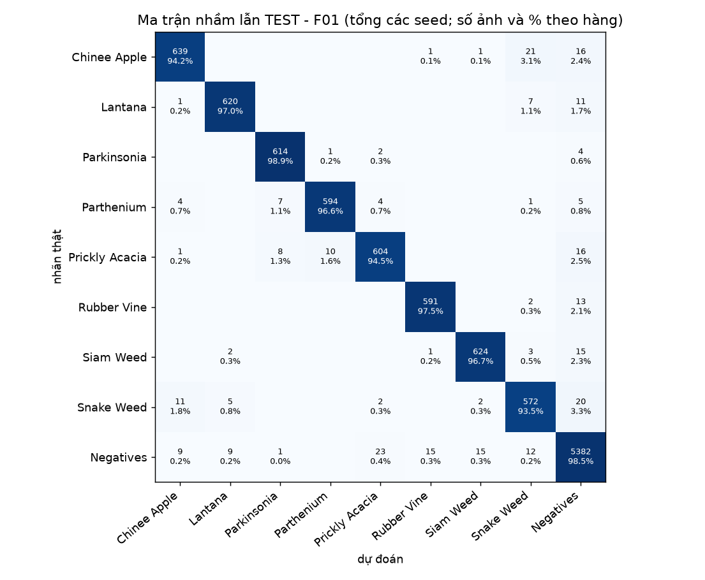
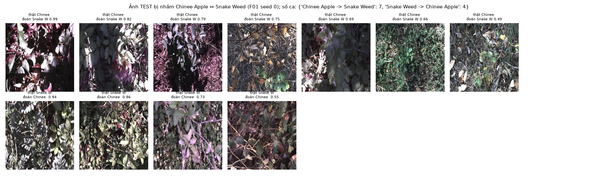

# Báo cáo Lab Day 2 — Backbone, công thức huấn luyện và suy luận trên DeepWeeds

**Sinh viên:** Đoàn Duy Bách · **MSSV:** 2A202602515 · **Phần cứng:** Apple M5 (GPU 10 nhân, MPS), 16 GB RAM

Mọi con số trong báo cáo đến từ lần chạy thật, truy ngược được qua `exp_id` → `logs/<exp_id>/seed<k>/` (config,
history, summary), `logs/<exp_id>_seed<k>.log` (log đầy đủ), `curves/<exp_id>_*.png` và `results.xlsx`.

## 1. Tóm tắt

Phân loại 9 lớp cỏ dại DeepWeeds (17.509 ảnh, fold 0 của tác giả; chỉ số chính là macro-F1). Đã chạy 6 backbone + 1
chẩn đoán, 8 ablation công thức huấn luyện trên DeiT-S (4 trục) + 1 kết hợp, 17 cấu hình suy luận (10 nhóm phương pháp)
trên val, và chung kết 3 seed; tổng cộng 20 lần huấn luyện 10 epoch trên Apple M5 (MPS). **Cấu hình tốt nhất (F01):**
DeiT-S tinh chỉnh toàn bộ, label smoothing 0,1 + crop nhẹ, suy luận ảnh đầy đủ resize 288 (1 view) + temperature scaling
khớp trên val.
**Test (3 seed, chạy một lần mỗi seed):** macro-F1 **0,9649 ± 0,0003**, top-1 **97,33 ± 0,06%**, recall Chinee apple
94,2 ± 0,8%, Snake weed 93,5 ± 0,7%, ECE 0,0093 ± 0,0010, p95 batch 1 = 20,5 ms. Mốc T00 + I00: macro-F1 0,9508 ± 0,0031,
nên Δ = +0,0141 (4,5 lần std). **Kết luận chính:** (1) họ backbone quyết định nhiều nhất (nhóm LayerNorm 0,95–0,97 so với
CNN BatchNorm 0,70–0,78 ở công thức nền); (2) với DeiT-S, toàn bộ cải thiện so với mốc đến từ suy luận ảnh đầy đủ ở 288
(+0,015 trên val, 3 seed), còn các thay đổi công thức huấn luyện không vượt nhiễu seed (σ = 0,0053); (3) TTA và multi-crop
không giúp mà tốn 2–10 lần độ trễ.

## 2. Dữ liệu và thiết lập

### 2.1 Chia dữ liệu và kiểm tra bắt buộc (README mục 2.1)

Dùng đúng **fold 0** của tác giả (`train_subset0.csv`, `val_subset0.csv`, `test_subset0.csv`), không sửa/lọc/chia lại.
Kết quả kiểm tra (`code/dataset.py::check_split`, lưu ở `logs/step0.json`, chạy lại ở đầu mỗi lần train):

| Kiểm tra | Kết quả |
|---|---|
| Số ảnh train / val / test | **10.501 / 3.501 / 3.507** (59,97% / 20,00% / 20,03%) |
| Giao train∩val, train∩test, val∩test (theo Filename) | 0 / 0 / 0 |
| Hợp ba tập | **17.509** ảnh (đúng tổng) |
| File trong CSV không có trên đĩa | 0 |

Số ảnh theo lớp (đếm thật) và đối chiếu Table 1 của bài báo:

| Lớp | train | val | test | tổng | Table 1 | lệch |
|---|---:|---:|---:|---:|---:|---:|
| Chinee Apple | 675 | 225 | 226 | 1.126 | 1.125 | +1 |
| Lantana | 637 | 213 | 213 | 1.063 | 1.064 | −1 |
| Parkinsonia | 618 | 206 | 207 | 1.031 | 1.031 | 0 |
| Parthenium | 613 | 204 | 205 | 1.022 | 1.022 | 0 |
| Prickly Acacia | 637 | 212 | 213 | 1.062 | 1.062 | 0 |
| Rubber Vine | 605 | 202 | 202 | 1.009 | 1.009 | 0 |
| Siam Weed | 644 | 215 | 215 | 1.074 | 1.074 | 0 |
| Snake Weed | 609 | 203 | 204 | 1.016 | 1.016 | 0 |
| Negatives | 5.463 | 1.821 | 1.822 | 9.106 | 9.106 | 0 |

Số đếm khớp Table 1 trừ một ảnh lệch giữa Chinee Apple và Lantana (nhãn trong `labels.csv` của repo tác giả khác
Table 1 đúng 1 ảnh; tổng vẫn 17.509). Ta dùng nhãn của CSV.

### 2.2 EDA

- **Mất cân bằng:** `Negatives` chiếm 52,0% dữ liệu; tỉ lệ lớp lớn nhất / nhỏ nhất = 9.106 / 1.009 = **9,0**. Một mô hình
  luôn đoán `Negatives` đạt top-1 52% nhưng macro-F1 chỉ ≈ 0,076, nên **macro-F1 là chỉ số chính**.
- **Ảnh** đều 256×256 RGB. Mean/std pixel trên 500 ảnh train: (0,341, 0,352, 0,343) / (0,227, 0,227, 0,224), tối hơn
  ImageNet; vẫn dùng mean/std ImageNet vì mọi trọng số tiền huấn luyện được chuẩn hoá theo đó.
- **Nhìn ảnh** (`figures/eda_samples.png`): ảnh chụp từ trên xuống, nền đất/lá khô, cây chiếm một phần khung hình.
  Chinee Apple và Snake Weed đều là lá xanh nhỏ trên nền rối, rất khó phân biệt bằng mắt; `Negatives` gồm đủ loại
  thực vật bản địa và nền, nên đa dạng hơn hẳn các lớp cỏ.

### 2.3 Kiểm tra pipeline trước khi chạy thật (GUIDE mục 1.3)

| Kiểm tra | Kết quả (`logs/step0.json`, `figures/sanity_*.png`) |
|---|---|
| Loss ban đầu, ResNet-50 tiền huấn luyện + head mới, 256 ảnh | **2,207** so với ln 9 = 2,197 |
| Overfit 1 batch 16 ảnh (60 bước AdamW) | loss 2,188 → **0,0095**, accuracy 16/16 ở eval mode |
| Ảnh sau augmentation (basic/color/trivial), CutMix/Mixup kèm λ | nhãn khớp ảnh (`sanity_augmentations.png`, `sanity_mix.png`) |
| Unit test tự viết (`code/test_code.py`, 22 test) | focal γ=0 ≡ CE (sai số < 1e-6); label smoothing ε=0 ≡ CE và khớp PyTorch; CutMix λ = diện tích thật; Mixup trộn cả nhãn; norm/bias không weight decay; đóng băng giữ BN ở eval; gộp BN sai số < 1e-4; precise-BN; temperature khôi phục T đã biết; lịch LR warmup+cosine; EMA |
| `train()`/`eval()` | `train_one_epoch` gọi `set_train_mode` (giữ phần đóng băng ở eval); mọi đánh giá dùng `model.eval()` + `torch.inference_mode()` |

### 2.4 Công thức nền T00 và quy ước

| Thành phần | Giá trị |
|---|---|
| Khởi tạo | Trọng số ImageNet của `timm` (tag ghi trong bảng), head mới 9 lớp, tinh chỉnh toàn bộ |
| Đầu vào | Train: `RandomResizedCrop(224)` (scale 0,08–1) + lật ngang. Val/test: `Resize(256)` + `CenterCrop(224)` (ảnh gốc 256 nên chỉ là center crop) |
| Optimizer | AdamW (β = 0,9/0,999); LR backbone 1e-4, head 1e-3; weight decay 0,05, **= 0 cho norm/bias/pos-embed** |
| Lịch LR | Warmup tuyến tính 1 epoch rồi cosine về 0, cập nhật theo **bước** |
| Loss | Cross-entropy |
| Batch / epoch | 64 / **10** (giảm từ 12–15 do ngân sách GPU, áp dụng cho mọi thí nghiệm) |
| Mixed precision | autocast **fp16** + GradScaler (trên M5: fp16 53 ảnh/s, fp32 43, bf16 35 với ResNet-50) |
| Chọn checkpoint | Epoch có macro-F1 val cao nhất (hòa → epoch sớm hơn); chỉ số tính bằng `eval.compute_metrics` |
| Seed | 0 cho Bước 1–3; 0, 1, 2 cho chung kết/mốc. Cố định `random`, `numpy`, `torch`, seed worker DataLoader |
| Thư viện | Python 3.12.14, torch 2.14.1, torchvision 0.29.1, timm 1.0.30, numpy 2.5.3, pandas 3.0.6 |

**Tái lập trên MPS:** chạy lại B06 với cùng seed cho đúng cùng số ở epoch 1 (train loss 1,8454, val F1 0,3554 cả hai lần,
`logs/step1_runner.out` và `logs/step1b_runner.out`). Một số run bị ngắt (máy ngủ/khởi động lại) đã **tiếp tục từ
checkpoint cuối epoch** (`last.pt`, có ghi `RESUME` trong log): B02 (từ epoch 4), T06 (từ epoch 8), T00 seed 2 (từ epoch 7,
sau khi một DataLoader worker bị hệ điều hành kill vì thiếu RAM). Model, optimizer, lịch LR, GradScaler và RNG được khôi
phục, nhưng **generator của DataLoader được seed lại từ đầu** (`dataset.make_loader`), nên các epoch sau khi tiếp tục dùng
lại đúng thứ tự ảnh và augmentation của các epoch đầu (với T00 seed 2: epoch 7–10 lặp lại epoch 1–4). Dấu hiệu thấy được:
train loss cuối của T00 seed 2 là 0,023 so với 0,058 / 0,059 của seed 0 / 1. Macro-F1 val của ba run này vẫn nằm trong
nhiễu seed (T00 seed 2: 0,9478, trung bình 3 seed 0,9522 ± 0,0053). Đây là lỗi đã biết, ghi ở mục 8; code không sửa sau khi
có kết quả để giữ đúng code đã sinh ra số liệu.

## 3. Bước 1 — So sánh backbone

Cùng công thức nền T00, cùng split, seed 0, 10 epoch. Tốc độ train đo riêng (`code/bench_train.py`, cùng điều kiện,
batch 64, fp16) vì thời gian/epoch trong log bị nhiễu (B05 chạy khi tiến trình còn trong sandbox chậm hơn; B03 chạy cùng
lúc với một job CPU). Độ trễ: batch 1, FP32, warmup 10, 50 lần đo, có `torch.mps.synchronize()`.

| exp_id | backbone (tag timm) | params (M) | GMAC | macro-F1 val | top-1 val | train (ảnh/s) | trễ b1 p50 / p95 (ms) |
|---|---|---:|---:|---:|---:|---:|---:|
| B01 | resnet50.a1_in1k | 23,5 | 4,11 | 0,7773 | 0,8369 | 35,8 | 10,0 / 12,3 |
| B02 | convnext_tiny.in12k_ft_in1k | 27,8 | 4,47 | **0,9688** | **0,9766** | 30,1 | 8,2 / 9,1 |
| B03 | deit_small_patch16_224.fb_in1k | 21,7 | 4,25 | 0,9508 | 0,9643 | 57,6 | 8,6 / 9,3 |
| B04 | swin_tiny_patch4_window7_224.ms_in1k | 27,5 | 4,51 | 0,9513 | 0,9640 | 48,7 | 10,5 / 11,1 |
| B05 | efficientnet_b0.ra_in1k (nhẹ) | 4,0 | 0,40 | 0,7660 | 0,8269 | 59,5 | 9,3 / 11,1 |
| B06 | mobilenetv3_large_100.ra_in1k (nhẹ) | 4,2 | 0,22 | 0,7050 | 0,7858 | 111,4 | 5,7 / 12,7 |
| D01 | = B06 nhưng huấn luyện **FP32** (chẩn đoán) | 4,2 | 0,22 | 0,6992 | 0,7818 | – | 5,1 / 5,4 |

GMAC đếm bằng fvcore. Ràng buộc: ResNet (B01), ConvNeXt (B02), transformer (B03, B04), mạng nhẹ (B05, B06).

**Nhận xét.**

1. **Hai nhóm tách bạch:** các mạng dùng LayerNorm (ConvNeXt, DeiT, Swin) đạt 0,95–0,97, còn ba CNN dùng BatchNorm
   (ResNet-50, EfficientNet-B0, MobileNetV3) chỉ đạt 0,70–0,78 và **underfit** rõ: train loss cuối 0,25–0,41 so với
   0,05–0,07 của nhóm kia (`curves/B0*.png`). Best epoch của mọi backbone đều là epoch 10: 10 epoch chưa đủ để hội tụ.
2. **Không phải lỗi AMP trên MPS:** D01 (FP32) cho 0,6992 so với 0,7050 của B06 (FP16), không phân biệt được.
   `code/diag_bn_mps.py` cũng cho thấy forward/backward ở train mode trên MPS FP32 khớp CPU (lệch output ≈ 1e-5).
3. **Giả thuyết (chưa kiểm chứng đầy đủ):** (a) LR 1e-4 thấp với các trọng số CNN này; `resnet50.a1_in1k` được huấn
   luyện bằng BCE + LAMB với LR lớn, nên tinh chỉnh bằng AdamW 1e-4 thường chậm; (b) `RandomResizedCrop` scale 0,08 hay
   cắt mất cây cỏ (vật thể chiếm một phần ảnh), gây nhiễu nhãn; (c) thống kê BatchNorm tích luỹ trên ảnh bị crop/phóng to
   lệch với ảnh center-crop lúc đánh giá (lệch kiểu FixRes). Bằng chứng cho (c): tính lại thống kê BN bằng toàn bộ ảnh
   train qua transform val (precise-BN, không dùng nhãn; `code/diag_precise_bn.py`, `logs/diag_precise_bn.json`, cột
   precise-BN ở sheet `Backbones`) nâng macro-F1 val của B01 từ 0,7768 lên 0,8178 (+0,041), B05 từ 0,7661 lên 0,8640
   (+0,098), B06 từ 0,7068 lên **0,8758 (+0,169)**. Số "trước" được đánh giá lại ở FP32 nên lệch ≤ 0,002 so với log train.
   Lệch thống kê BN giải thích phần lớn khoảng cách, nhưng sau precise-BN ba CNN này vẫn kém nhóm LayerNorm 0,08–0,15, nên
   (a) và (b) có thể vẫn góp phần. Hệ quả: thứ hạng backbone ở bước này gắn với công thức nền; DeiT-S không có BN nên không
   chịu ảnh hưởng này.
4. **Thứ hạng khác ImageNet:** trên ImageNet, ResNet-50 (a1) ≈ ConvNeXt-T và hơn DeiT-S, nhưng ở đây thua xa 17–19
   điểm. Kết luận "kiến trúc nào tốt hơn" chỉ đúng với **công thức nền này**; một phần lợi thế của ConvNeXt-T đến từ trọng
   số tiền huấn luyện trên ImageNet-12k (`in12k_ft_in1k`), không chỉ từ kiến trúc.
5. **FLOPs không dự đoán được tốc độ:** DeiT-S (4,25 GMAC) train nhanh gần gấp đôi ConvNeXt-T (4,47 GMAC); MobileNetV3
   (0,22 GMAC) có độ trễ batch-1 p50 5,7 ms, chỉ nhanh hơn DeiT-S 1,5 lần dù ít FLOPs hơn ~19 lần. Ở batch 1, chi phí
   khởi chạy kernel trên GPU chiếm phần lớn thời gian.

**Chọn backbone đi tiếp: DeiT-S (B03).** ConvNeXt-T có macro-F1 cao nhất (0,9688, hơn DeiT-S 1,8 điểm, 1 seed), nhưng
train chậm gần gấp đôi (30,1 so với 57,6 ảnh/s). Với 13 lần huấn luyện còn lại của Bước 2 và 4 (T01–T09, thêm 2 seed cho
mốc và 2 seed cho chung kết), chọn ConvNeXt-T sẽ tốn thêm khoảng 5–6 giờ GPU. DeiT-S ngang Swin-T về chất lượng (0,9508 so với 0,9513) nhưng train nhanh hơn 18%, có độ trễ
thấp và trọng số chỉ tiền huấn luyện trên ImageNet-1k. Đây là lựa chọn cân bằng nhất giữa chất lượng, chi phí huấn
luyện và độ trễ. ConvNeXt-T vẫn được dùng trong ensemble ở Bước 3.

## 4. Bước 2 — Công thức huấn luyện (DeiT-S)

Mỗi run chỉ khác T00 **một yếu tố**, seed 0, 10 epoch. T00 seed 0 chính là B03 (cùng cấu hình, sao chép bằng
`experiments.py --alias`, ghi chú ở `logs/T00/seed0/ALIAS.txt`). 4 trục: A (khởi tạo), B (augmentation), C (loss),
F (chính quy hoá). Không dùng cách tham lam theo trục: mọi run đều so với cùng một T00, rồi kết hợp ở T09.

| exp_id | trục | khác T00 ở điểm nào | macro-F1 val | top-1 val | Δ F1 | F1 Chinee | F1 Snake | ECE val |
|---|---|---|---:|---:|---:|---:|---:|---:|
| T00 | – | công thức nền | 0,9508 | 0,9643 | – | 0,8945 | 0,8966 | 0,0060 |
| T01 | A | đóng băng backbone, chỉ train head | 0,7329 | 0,7932 | −0,2179 | 0,6262 | 0,6537 | 0,0350 |
| T02 | B | RandomResizedCrop scale (0,35, 1) | 0,9528 | 0,9646 | +0,0021 | 0,8981 | 0,9073 | 0,0092 |
| T03 | B | + CutMix (α = 1) | 0,9504 | 0,9632 | −0,0004 | 0,9049 | 0,9055 | 0,0222 |
| T04 | B | + TrivialAugmentWide | 0,9529 | 0,9663 | +0,0021 | 0,8993 | 0,8841 | 0,0057 |
| T05 | C | label smoothing ε = 0,1 | **0,9573** | **0,9683** | **+0,0066** | 0,9074 | 0,9029 | 0,0997 |
| T06 | C | focal loss γ = 2 | 0,9435 | 0,9597 | −0,0072 | 0,8868 | 0,8780 | 0,0665 |
| T07 | C | CE trọng số lớp 1/n_c | 0,9346 | 0,9454 | −0,0161 | 0,8959 | 0,8539 | 0,0104 |
| T08 | F | EMA 0,999 (đánh giá bằng trọng số EMA) | 0,9493 | 0,9637 | −0,0015 | 0,8894 | 0,8894 | 0,0061 |
| T09 | B+C | label smoothing + crop nhẹ (kết hợp) | 0,9531 | 0,9660 | +0,0023 | 0,9099 | 0,9055 | 0,0932 |

**Mức nhiễu.** T00 chạy 3 seed (cùng cấu hình, chỉ khác seed) cho macro-F1 val 0,9508 / 0,9581 / 0,9478, tức std
**σ = 0,0053**. Mỗi ablation chỉ có 1 seed và được so với T00 seed 0, nên hiệu của hai lần chạy có std ≈ √2·σ ≈ **0,0075**.
Quy ước: |Δ| ≤ 0,0075 là không phân biệt được, 0,0075–0,015 là "có thể khác, chưa chắc", > 0,015 là khác rõ (cột "so với
nhiễu" ở sheet `Training`, có thêm hai dòng T00 seed 1, 2). Ví dụ: riêng T00 seed 1 đã hơn seed 0 tới +0,0074 dù cấu hình
giống hệt, lớn hơn Δ của mọi ablation có lợi trong bảng trên.

**Nhận xét theo trục.**

- **A. Khởi tạo:** đóng băng backbone (linear probe) mất 21,8 điểm. Đặc trưng ImageNet chưa tách được các loài cỏ trên
  nền rối; phải tinh chỉnh toàn bộ. Đổi lại, T01 rẻ nhất (9,8 phút so với ~35 phút).
- **B. Augmentation:** crop nhẹ (+0,0021) và TrivialAugment (+0,0021) nhích nhẹ, CutMix (−0,0004) không đổi; cả ba
  đều **nhỏ hơn nhiễu** nên "không phân biệt được" với T00. CutMix có thể cắt mất cây cỏ nhỏ (nhãn trộn theo diện tích
  không phản ánh đúng nội dung) và thường cần nhiều epoch hơn 10 mới có lợi.
- **C. Loss:** label smoothing có Δ lớn nhất (+0,0066) nhưng vẫn nhỏ hơn √2·σ, tức **chưa vượt nhiễu**; kiểm chứng 3 seed
  ở mục 6.4 cho thấy nó không có lợi khi kết hợp. Hai loss nhắm vào mất cân bằng không giúp: CE trọng số **làm giảm rõ**
  macro-F1 (−0,0161, lớn hơn 2√2·σ), focal (−0,0072) nghiêng về kém hơn nhưng chưa vượt nhiễu. CE trọng số tăng recall
  các lớp cỏ (Snake Weed recall 0,936 so với 0,897; balanced acc 0,9571 so với 0,9512) nhưng recall `Negatives` giảm từ
  0,980 xuống 0,932: ảnh `Negatives` bị
  đẩy sang các lớp cỏ, precision lớp cỏ giảm, macro-F1 giảm. Với tỉ lệ mất cân bằng chỉ 9:1 và mỗi lớp cỏ có ~600 ảnh
  train, CE thường đã đủ; trọng số 1/n_c (Negatives ≈ 0,12 so với ≈ 1,1) quá mạnh.
- **F. EMA:** −0,0015, không phân biệt được. Với 10 epoch (1.640 bước) và decay 0,999 (chân trời ~1.000 bước), trọng
  số EMA còn "nhớ" các epoch đầu khi LR cao; EMA thường có lợi khi huấn luyện dài hơn.
- **ECE:** label smoothing làm mô hình **thiếu tự tin** (ECE 0,0997 so với 0,0060); temperature scaling ở chung kết sửa
  được điều này (mục 6).

**Kết hợp T09 (label smoothing + crop nhẹ):** macro-F1 val 0,9531 (Δ +0,0023), thấp hơn T05 một mình (0,9573) và ngang
T02 (0,9528). Hai hiệu ứng **không cộng dồn**, và mọi chênh lệch ở đây đều nằm trong nhiễu. Kiểm chứng với 3 seed (F01 dùng
đúng công thức T09, đánh giá 1 view 224): 0,9512 ± 0,0017 so với 0,9522 ± 0,0053 của T00, tức công thức kết hợp **không tốt
hơn nền**. Trên đường cong (`curves/T09_ls_mildcrop.png`, `curves/F01_final_ls_mildcrop.png`), train loss dừng ở khoảng
0,50 thay vì 0,02–0,06 như T00. Đó là sàn của loss khi dùng label smoothing ε = 0,1, không phải underfit: val loss vẫn
giảm đều.

**Quy trình chọn:** công thức chung kết F01 = T09 được chốt **trước** khi T09 chạy xong (ghi lúc 20:32 ngày 04/10 trong
`code/queue_final.flag`; T09 train từ 23:06 đến 23:41), dựa trên hai trục có Δ > 0 trên val (T02, T05). Lựa chọn này
không được xem lại sau khi có T09. T09 và T05 không phân biệt được (−0,0042 < √2·σ), nên chọn T05 cũng hợp lý như nhau.
Test không được dùng cho quyết định này.

## 5. Bước 3 — Phương pháp suy luận (checkpoint T00 seed 0, đánh giá trên val)

Độ trễ: Apple M5 GPU (MPS), torch 2.14.1, chỉ forward model trên tensor đã ở GPU (**không tính tiền xử lý**), warmup 10,
100 lần đo (batch 32: 33 lần), `torch.mps.synchronize()` trước và sau mỗi lần đo. Đầy đủ ở sheet `Latency`.

| exp_id | phương pháp | K | macro-F1 val | top-1 val | ECE val | trễ b1 p50 / p95 / p99 (ms) | chi phí so với I00 |
|---|---|---:|---:|---:|---:|---:|---:|
| I00 | 1 view (CenterCrop 224), FP32 | 1 | 0,9508 | 0,9643 | 0,0062 | 7,2 / 8,6 / 11,1 | 1,0× |
| I01 | TTA lật ngang, gộp xác suất | 2 | 0,9505 | 0,9649 | 0,0036 | 14,2 / 15,2 / 15,3 | 2,0× |
| I03a | TTA lật ngang, gộp logit | 2 | 0,9499 | 0,9643 | 0,0020 | như I01 | 2,0× |
| I02a | 5-crop 224 từ ảnh 256 | 5 | 0,9498 | 0,9640 | 0,0061 | – | ~5× |
| I02b | 5-crop + lật, gộp xác suất | 10 | 0,9508 | 0,9654 | 0,0080 | 68,1 / 77,8 / 86,4 | 9,4× |
| I03b | 5-crop + lật, gộp logit | 10 | 0,9511 | 0,9654 | 0,0050 | như I02b | 9,4× |
| I02c | đa tỉ lệ 224/256/288 trên ảnh đầy đủ, gộp xác suất | 3 | 0,9661 | 0,9751 | 0,0119 | 38,3 / 46,7 / 47,4 | 5,3× |
| I03c | đa tỉ lệ, gộp logit | 3 | 0,9656 | 0,9749 | 0,0045 | như I02c | 5,3× |
| I04 | ảnh đầy đủ resize 224 / 256 / **288** / 320 | 1 | 0,9525 / 0,9520 / **0,9643** / 0,9646 | 0,9652 / 0,9654 / **0,9740** / 0,9749 | 0,011 / 0,004 / 0,005 / 0,005 | 288: 14,3 / 20,5 / 21,3 | 288: 2,0× |
| I05 | ensemble B03 + B04 + B02 (TB xác suất) | 3 | **0,9693** | **0,9780** | 0,0167 | 34,4 / 37,5 / 37,8 | 4,8× |
| I06 | trọng số EMA (T08) | 1 | 0,9493 | 0,9637 | 0,0061 | như I00 | 1,0× |
| I07 | I00 + temperature (T = 1,021) | 1 | 0,9508 | 0,9643 | 0,0059 (chéo: 0,0101) | như I00 | 1,0× |
| I08b | FP16 (`model.half()`) | 1 | 0,9508 | 0,9643 | 0,0055 | **4,5 / 4,9 / 5,1** | 0,63× |
| I08c | AMP (autocast fp16) | 1 | 0,9508 | 0,9643 | 0,0056 | 5,7 / 6,3 / 6,7 | 0,78× |

Gộp BN (I08a) và precise-BN (I09) **không áp dụng** cho DeiT-S (LayerNorm, không có BatchNorm); hàm `fuse_conv_bn` và
`recalibrate_bn` đã kiểm tra trên ResNet/EfficientNet trong unit test.

**Nhận xét.**

- **Độ phân giải là yếu tố suy luận mạnh nhất:** dùng ảnh đầy đủ ở 288 (1 view) tăng **+0,0135** macro-F1 trên checkpoint
  T00 seed 0, lớn hơn mọi chênh lệch của Bước 2 và gấp khoảng 2,5 lần σ. Kiểm chứng sau chung kết trên cả 3 checkpoint T00:
  +0,0149 ± 0,0038 (mục 6.4). Đúng hiệu ứng FixRes (slide trang 68): `RandomResizedCrop` khi train
  làm vật thể trông to hơn so với ảnh val, nên test ở độ phân giải cao hơn (và không cắt mất viền ảnh) bù được sự lệch
  này. Lên 320 thì bão hoà (0,9646). Ảnh gốc chỉ 256 px, nên 288/320 là phóng to; lợi ích đến từ kích thước biểu kiến
  của vật thể, không phải chi tiết mới.
- **TTA lật / multi-crop không giúp** (|Δ| ≤ 0,001) mà tốn 2–10× độ trễ: ảnh chụp từ trên xuống vốn gần như bất biến với
  phép lật, và crop 224 từ ảnh 256 lặp lại đúng sự lệch kích thước nói trên.
- **Gộp xác suất và gộp logit** cho macro-F1 như nhau (chênh ≤ 0,0006), nhưng gộp logit luôn cho ECE thấp hơn
  (0,0020 so với 0,0036; 0,0045 so với 0,0119). Khi dùng nhiều view nên gộp logit (một T duy nhất áp lên logit gộp);
  chung kết chỉ dùng 1 view nên không cần gộp.
- **Ensemble 3 backbone** đạt cao nhất (0,9693) nhưng gần như chỉ bằng thành viên tốt nhất (ConvNeXt-T 0,9688), tốn 4,8×.
- **Temperature scaling trên T00:** T = 1,021 ≈ 1, vì mô hình CE vốn đã hiệu chuẩn tốt. ECE trong mẫu giảm rất ít
  (0,0062 → 0,0059); ước lượng chéo (khớp T trên một nửa val, đo trên nửa kia) cho ECE 0,0101, tức với mô hình đã hiệu
  chuẩn tốt, temperature scaling **không** cải thiện ECE một cách đáng tin (biểu đồ độ tin cậy trước/sau:
  `figures/reliability_I00_vs_I07.png`). Với mô hình label smoothing thì khác hẳn: xem mục 6.2.
- **FP16** giữ nguyên macro-F1 và giảm độ trễ batch 1 từ 7,2 xuống 4,5 ms (batch 32: 221 → 400 ảnh/s). Trên M5, AMP
  (autocast) chậm hơn `model.half()` vì chi phí ép kiểu ở mỗi lớp, nhưng vẫn nhanh hơn FP32.
- **Ngoại tuyến và thời gian thực:** mọi phương pháp đều dưới ngân sách 100 ms ở batch 1 trên M5. Phù hợp robot: những
  phương pháp không tốn thêm hoặc tốn ít, như độ phân giải 288 (1 view, p95 20,5 ms), FP16, temperature. Chỉ hợp
  ngoại tuyến: 10-crop (9,4×), ensemble (4,8×), đa tỉ lệ (5,3×). Dữ liệu ủng hộ kết luận của slide, kèm một bổ sung:
  ở đây "dò độ phân giải" vừa rẻ vừa là phương pháp có lợi nhất.

**Chọn suy luận cho chung kết (chỉ dựa trên val):** ảnh đầy đủ resize **288, 1 view** (I04_288) + temperature scaling khớp
trên val từng seed. Đa tỉ lệ K=3 (0,9661) không phân biệt được với 288 1 view (0,9643) mà tốn gấp 2,7 lần.

## 6. Bước 4 — Cấu hình tốt nhất và kết quả test

### 6.1 Cấu hình chung kết F01 (chốt hoàn toàn trên val)

| Thành phần | Giá trị | Căn cứ |
|---|---|---|
| Backbone | `deit_small_patch16_224.fb_in1k` (timm), tinh chỉnh toàn bộ, head mới 9 lớp | Bước 1: cân bằng chất lượng, chi phí train, độ trễ |
| Huấn luyện | như T00, nhưng CE + label smoothing ε = 0,1 và `RandomResizedCrop(224, scale = (0,35, 1))` + lật ngang (= T09). AdamW, LR 1e-4 / 1e-3, weight decay 0,05 (0 cho norm/bias/pos-embed), warmup 1 epoch + cosine, batch 64, 10 epoch, AMP fp16; checkpoint = epoch có macro-F1 val cao nhất | Bước 2: hai trục có Δ > 0 trên val (chốt trước khi có T09, xem mục 4) |
| Seed | 0 (= lần chạy T09, sao chép bằng `--alias T09 F01`), 1, 2 | |
| Suy luận | ảnh đầy đủ 256 × 256 resize lên **288 × 288** (không crop), 1 view, FP32, pos-embed nội suy (`dynamic_img_size`) | Bước 3: I04_288 |
| Hiệu chuẩn | temperature scaling, T khớp trên val **của từng seed**: T = 0,639 / 0,616 / 0,608 (< 1 vì label smoothing làm mô hình thiếu tự tin) | S2, S4 |
| Mốc | T00 + I00 (công thức nền, Resize 256 + CenterCrop 224, 1 view, T = 1), cùng 3 seed | GUIDE mục 5 |

Lệnh tái lập ở `README.md` (mục "Thứ tự chạy"). Test chạy bằng `code/step4_final.py`, **đúng một lần mỗi seed**: script ghi
file khoá `runs/<exp>/seed<k>/test_done.json` (thời điểm chạy ghi trong file: 01:00–01:08 ngày 05/10) và từ chối chạy lại.
Không cấu hình nào được chọn hay sửa sau khi xem test.

### 6.2 Kết quả test (3.507 ảnh, mean ± std qua 3 seed, tính bằng `eval.py score`)

| Cấu hình | macro-F1 val | **macro-F1 test** | top-1 test | balanced acc | ECE test | recall Chinee apple | recall Snake weed | p95 batch 1 |
|---|---:|---:|---:|---:|---:|---:|---:|---:|
| **F01** (chung kết) | 0,9666 ± 0,0043 | **0,9649 ± 0,0003** | **0,9733 ± 0,0006** | 0,9638 ± 0,0018 | 0,0093 ± 0,0010 | **0,9425 ± 0,0077** | **0,9346 ± 0,0075** | 20,5 ms |
| F01 khi T = 1 (chưa hiệu chuẩn) | – | 0,9649 ± 0,0003 | 0,9733 ± 0,0006 | 0,9638 ± 0,0018 | 0,0847 ± 0,0013 | 0,9425 ± 0,0077 | 0,9346 ± 0,0075 | 20,5 ms |
| T00 + I00 (mốc) | 0,9522 ± 0,0053 | 0,9508 ± 0,0031 | 0,9621 ± 0,0027 | 0,9511 ± 0,0010 | 0,0074 ± 0,0022 | 0,8584 ± 0,0203 | 0,9363 ± 0,0049 | 8,6 ms |

Theo từng seed (macro-F1 test): F01 0,9651 / 0,9646 / 0,9651; T00 0,9497 / 0,9484 / 0,9544 (sheet `Final`). F1 test của
hai lớp khó: Chinee apple 0,9516 ± 0,0023 (mốc 0,9107 ± 0,0056), Snake weed 0,9301 ± 0,0048 (mốc 0,9250 ± 0,0084); đủ 9
lớp ở sheet `PerClass`.

- **So với mốc:** Δ macro-F1 = **+0,0141**, gấp 4,5 lần std lớn hơn của hai nhóm (0,0031), **vượt nhiễu rõ**. Top-1 tăng
  1,1 điểm, recall Chinee apple tăng 8,4 điểm; recall Snake weed không đổi (0,9346 so với 0,9363, trong nhiễu).
- **Hiệu chuẩn:** label smoothing làm mô hình thiếu tự tin (ECE test 0,0847 khi T = 1). T khớp trên val (0,61–0,64) đưa ECE
  về 0,0093, ngang mốc CE (0,0074 ± 0,0022; chênh nhỏ hơn 1 std). Temperature không đổi argmax nên macro-F1 và top-1 giữ
  nguyên.
- **Ổn định val/test:** macro-F1 val 0,9666 so với test 0,9649 (chênh 0,0017).
- **Cấu hình thời gian thực (RUBRIC I5):** chính F01 dùng được cho robot: p95 batch 1 = **20,5 ms** (p50 14,3, p99 21,3;
  Apple M5 MPS, FP32, warmup 10, 100 lần đo, `torch.mps.synchronize()`, không tính tiền xử lý), macro-F1 test 0,9649.
- **`eval.py grade`** (đề xuất, ngưỡng tạm thời): I1 7/7, I2 5/5, I3 4/4, I4a 1/1, I4b 1/1, I5 2/2, tổng **20/20**
  (`logs/eval/grade_I.json`).
- **Đối chiếu bài báo** (README mục 2.3, số trích dẫn): ResNet-50 của bài báo đạt 95,7% (weighted average, 5 fold, khoảng
  100 epoch), hai lớp kém nhất là Chinee apple 88,5% và Snake weed 88,8%. Ta đạt top-1 97,3% và recall 94,2% / 93,5% sau 10
  epoch, nhưng **không so sánh trực tiếp được**: khác định nghĩa accuracy, chỉ 1 fold, khác backbone và độ phân giải. Các cặp
  nhầm chính có cùng hướng với bài báo: Chinee apple → Snake weed 3,1% (bài báo 3,4%), Snake weed → Chinee apple 1,8% (4,1%),
  Parkinsonia → Prickly acacia 0,3% (1,3%).

### 6.3 Ma trận nhầm lẫn và phân tích lỗi

Ma trận cộng 3 seed (3 × 3.507 = 10.521 dự đoán); ma trận của mốc ở `figures/confusion_test_T00.png`. F01 sai 281 lần,
mốc sai 399 lần:

| Loại lỗi (tổng 3 seed) | F01 | T00 + I00 |
|---|---:|---:|
| cỏ → `Negatives` (bỏ sót cỏ) | 100 | 136 |
| `Negatives` → cỏ (báo nhầm) | 84 | 133 |
| cỏ ↔ cỏ | 97 | 130 |
| trong đó Chinee apple → Snake weed / Snake weed → Chinee apple | 21 / 11 | 38 / 4 |
| Chinee apple → `Negatives` | 16 | 46 |

- **Lỗi chủ yếu nằm ở ranh giới cỏ ↔ `Negatives`** (184/281 = 65% lỗi của F01). `Negatives` gồm thực vật bản địa và nền
  đủ loại, nhiều ảnh trông giống cây cỏ; ảnh có cây cỏ chỉ chiếm một góc khung hình dễ bị đoán là `Negatives`.
- **Chinee apple cải thiện nhiều nhất** (recall 85,8% → 94,2%): nhầm sang `Negatives` giảm từ 46 xuống 16, sang Snake weed từ
  38 xuống 21. Trên val, mức tăng này đến từ cách suy luận chứ không từ công thức huấn luyện: F1 Chinee apple của chính T00
  tăng từ 0,894 (CenterCrop 224) lên 0,929 (ảnh đầy đủ 288), trung bình 3 seed (mục 6.4). Giả thuyết: CenterCrop 224 từ ảnh
  256 bỏ 23% diện tích ở viền, có thể cắt mất cây cỏ nằm sát mép; đồng thời `RandomResizedCrop` khi train làm vật thể trông
  to hơn so với lúc test (FixRes). Ảnh đầy đủ ở 288 bù được cả hai.
- **Ảnh bị nhầm Chinee apple ↔ Snake weed** (F01 seed 0, 7 + 4 ảnh, sắp theo độ tin cậy của nhãn đoán sai):

  Quan sát: (1) nhiều ảnh có **nắng gắt và bóng đổ mạnh**, vài ảnh **ám màu tím hồng**, làm mất màu lá; (2) **nền rất rối**
  (lá khô, cành, nhiều loài đan xen), cây cỏ không nổi bật; (3) cả hai loài là cây bụi lá xanh nhỏ, ở 256 px khó thấy mép
  lá và cách mọc lá. Một số ảnh sai với độ tin cậy cao (0,99; 0,94), nên đây không chỉ là các ca lưng chừng. Giả thuyết: mô
  hình dựa vào màu và kết cấu tổng thể nhiều hơn hình dạng lá; một số ảnh có thể chứa cả hai loài trong khi nhãn chỉ có một
  lớp. Hướng thử: augmentation màu/độ sáng mạnh hơn, train ở độ phân giải cao hơn, rà lại nhãn của các ca sai với độ tin
  cậy cao.

### 6.4 Phân tách đóng góp: công thức huấn luyện × suy luận (val, 3 seed, phân tích sau chung kết)

Để biết cải thiện đến từ đâu mà **không chạy thêm test**, sau Bước 4 ta đánh giá lại 6 checkpoint của chung kết và mốc trên
**val** theo lưới 2 × 2 (`code/diag_factorial_val.py`, `logs/diag_factorial_val.json`, sheet `Decomposition`). Phân tích này
không thay đổi cấu hình chung kết.

| macro-F1 val (mean ± std, 3 seed) | I00: CenterCrop 224 | I04_288: ảnh đầy đủ 288 | hiệu ứng suy luận (cặp, cùng checkpoint) |
|---|---:|---:|---:|
| T00 (công thức nền) | 0,9522 ± 0,0053 | 0,9672 ± 0,0029 | **+0,0149 ± 0,0038** |
| F01 (label smoothing + crop nhẹ) | 0,9512 ± 0,0017 | 0,9666 ± 0,0043 | **+0,0154 ± 0,0058** |
| hiệu ứng công thức (F01 − T00) | −0,0010 (s = 0,0053) | −0,0005 (s = 0,0043) | tương tác +0,0005 |

**Toàn bộ cải thiện của F01 so với mốc đến từ suy luận ảnh đầy đủ ở 288**: +0,015, dương ở cả 6 checkpoint (từ +0,009 đến
+0,020). Công thức huấn luyện mới không đóng góp gì đo được, và hai yếu tố không tương tác. Nói cách khác, nếu chọn lại trên
val thì một cấu hình đơn giản hơn là **T00 + I04_288** (CE thường, vốn đã hiệu chuẩn tốt) cũng ngang bằng. Theo quy tắc chỉ
chạy test một lần, ta **không** chạy test cho cấu hình này; số test ở 6.2 vẫn là của F01 như đã chốt.

## 7. Kết luận và khuyến nghị

1. **Cấu hình nào tốt nhất, tốt hơn mốc bao nhiêu?** F01: DeiT-S tinh chỉnh toàn bộ, label smoothing 0,1 + crop nhẹ, suy
   luận ảnh đầy đủ 288 (1 view) + temperature scaling khớp trên val. Test 3 seed: macro-F1 **0,9649 ± 0,0003**, top-1
   97,33 ± 0,06%, recall Chinee apple 94,2%, Snake weed 93,5%. Tốt hơn mốc T00 + I00 **+0,0141** macro-F1, gấp 4,5 lần std,
   tức **vượt nhiễu rõ** (sheet `Final`, `Summary`).
2. **Yếu tố nào đóng góp nhiều nhất?**
   - **Backbone** tạo chênh lệch lớn nhất giữa các họ mạng: cùng công thức nền, nhóm LayerNorm (ConvNeXt-T, DeiT-S, Swin-T)
     đạt 0,951–0,969, còn ba CNN BatchNorm chỉ đạt 0,705–0,777 (sheet `Backbones`). Một phần khoảng cách này do lệch thống kê
     BN: precise-BN thu hẹp còn 0,08–0,15. Giữa các backbone mạnh, chênh lệch nhỏ hơn: ConvNeXt-T hơn DeiT-S 0,018 (1 seed).
   - Khi đã cố định DeiT-S, **suy luận** là đòn bẩy lớn nhất: ảnh đầy đủ ở 288 cho +0,015 ± 0,004 trên val (3 seed, sheet
     `Decomposition`) và là nguồn của toàn bộ cải thiện so với mốc.
   - **Công thức huấn luyện** gần như không đóng góp trong phạm vi đã thử. Không thay đổi nào tốt hơn T00 vượt nhiễu (Δ lớn
     nhất +0,0066 < √2·σ = 0,0075, sheet `Training`), và kết hợp T09/F01 bằng nền (−0,0005 đến −0,0010, 3 seed). Có những
     lựa chọn **gây hại rõ**: đóng băng backbone (−0,218), CE trọng số lớp (−0,016).
   - TTA lật, multi-crop, gộp logit hay xác suất không giúp (|Δ| ≤ 0,001) mà tốn 2–10 lần độ trễ; ensemble 3 backbone chỉ
     ngang thành viên tốt nhất (sheet `Inference`).
3. **Triển khai trên robot (ngân sách 30–100 ms/khung):** chọn **DeiT-S + ảnh đầy đủ 288, 1 view**: p95 20,5 ms trên M5,
   còn dư cho tiền xử lý; không dùng TTA hay ensemble. Vì công thức huấn luyện không đóng góp, nên ưu tiên công thức nền CE
   (đơn giản, tự hiệu chuẩn tốt, T ≈ 1). Nếu giữ label smoothing thì **bắt buộc** temperature scaling (ECE 0,085 → 0,009).
   Trước khi triển khai cần đo lại độ trễ trên phần cứng của robot (ví dụ Jetson; FP16 đã giảm 37% độ trễ ở 224 mà không đổi
   macro-F1 val), và kiểm tra trên ảnh từ địa điểm hoặc mùa mới (mục 8). Nếu chạy ngoại tuyến và không bị giới hạn độ trễ,
   ứng viên đáng thử tiếp là ConvNeXt-T với suy luận 288 (chưa chạy).

## 8. Hạn chế và việc tiếp theo

- **Thống kê:** ablation ở Bước 1–3 chỉ có 1 seed; chỉ chung kết và mốc có 3 seed. Với σ = 0,0053, phần lớn Δ ở Bước 2
  không phân biệt được, nên "không giúp" ở đây chỉ có nghĩa là không phát hiện được hiệu ứng lớn hơn khoảng 0,0075.
- **Một fold, chia ngẫu nhiên:** chỉ dùng fold 0. Tác giả chia ngẫu nhiên chứ không theo địa điểm, nên ảnh cùng địa điểm
  hay cùng buổi chụp có thể nằm ở cả train và test. Điểm test vì vậy **có thể lạc quan** so với khi robot gặp địa điểm mới.
  Chưa chạy nhiều fold.
- **Lệch phân phối:** ánh sáng, mùa, máy ảnh hay độ cao chụp khác đi sẽ làm giảm độ chính xác; nhiệt độ T khớp trên val
  cũng có thể không còn đúng khi miền thay đổi. Chưa đánh giá trên ảnh nhiễu, mờ hoặc thiếu sáng.
- **Giảm bớt do ngân sách GPU** (Apple M5, khoảng 12 giờ train cho 20 run): 10 epoch cho mọi thí nghiệm, trong khi mọi
  backbone đều đạt best ở epoch 10 nên chưa hội tụ hẳn; Bước 2 chỉ chạy trên DeiT-S; không đi tiếp với ConvNeXt-T dù nó tốt
  nhất ở Bước 1; không train ở độ phân giải cao hơn.
- **Thí nghiệm thất bại và sự cố:** ba CNN có BatchNorm underfit ở công thức nền (đã chẩn đoán bằng D01 và precise-BN nhưng
  chưa sửa công thức cho chúng). B02, T06 và T00 seed 2 bị ngắt (máy ngủ hoặc khởi động lại; DataLoader worker bị kill vì
  thiếu RAM) và được tiếp tục từ `last.pt`. Lỗi đã biết: khi tiếp tục, generator của DataLoader được seed lại nên các epoch
  sau đó lặp lại thứ tự ảnh và augmentation của các epoch đầu (mục 2.4). Số liệu của ba run này vẫn trong nhiễu seed, nhưng
  chúng không hoàn toàn tương đương lần chạy liền mạch.
- **Phát hiện sau khi chạy test:** công thức huấn luyện của F01 không tốt hơn nền (mục 6.4), nên T00 + I04_288 là cấu hình
  đơn giản hơn mà ngang bằng trên val, nhưng không có số test vì không chạy test lần hai. Phân tích ở mục 6.4 chạy sau test
  và chỉ dùng val.
- **Độ trễ** đo trên M5 (GPU tích hợp, bộ nhớ dùng chung), FP32, không tính tiền xử lý; chưa đo FP16 ở 288 và chưa đo trên
  phần cứng của robot.
- **Việc tiếp theo:** (1) chạy nhiều fold, lý tưởng là chia theo địa điểm; (2) ConvNeXt-T với suy luận 288, hoặc tinh chỉnh
  ngắn ở 288 (FixRes); (3) sửa công thức cho CNN BatchNorm (LR lớn hơn, crop nhẹ, precise-BN) rồi so lại; (4) chưng cất từ
  ensemble sang mô hình nhỏ cho robot; (5) đánh giá độ bền trên ảnh làm tối, mờ, nhiễu và thử thích ứng lúc kiểm tra; (6)
  xuất ONNX/TensorRT và đo trên Jetson; (7) sửa lỗi seed của DataLoader khi tiếp tục run.

## 9. Phụ lục

- Danh sách `exp_id` và cấu hình đầy đủ: `code/experiments.py` (COMMON + BACKBONES/DIAG/TRAINING/FINAL), cấu hình
  từng run (kèm tag trọng số, phiên bản thư viện, nhóm tham số) ở `logs/<exp_id>/seed<k>/config.json`.
- Notebook: `code/lab_day2.ipynb` (link Colab trong `README.md`).
- Bảng số liệu: `results.xlsx` (Summary, Backbones, Training, Inference, Final, PerClass, Latency, Decomposition).
- Đầu ra của `eval.py score` / `grade`: `logs/eval/` (lệnh ở `README.md`). Chẩn đoán: `logs/diag_bn_mps.json`,
  `logs/diag_precise_bn.json`, `logs/diag_factorial_val.json`.
